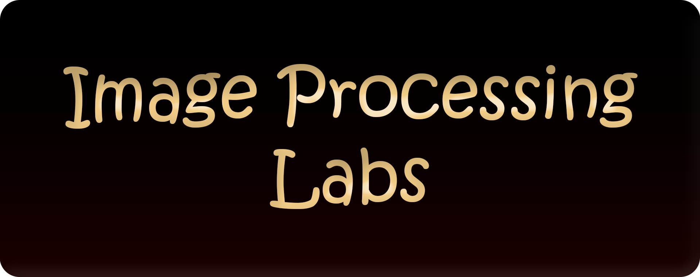

*   This repository contains Lab exercises covered under " CS3713-Image Processing" module in semester 5, UOM CSE, which had coding involved.

## Point Operations

A Python script to carry out the following operations:

1. Loading a colour image (in JPG or PNG format) from the disk and convert the image to 8-bpp grayscale format.

2. Creating a 3x2 sub-plot and display the gray-scale image and output images images  in different grid positions as follows.

*   grid (1,1) :  unprocessed gray-scale image
*   grid (1,2): negative image
*   grid (1,3): increased brightness by 20% on each pixel
*   grid (2,1): Reduce image contrast such that gray levels remain between 125 and 175
*   grid (2,2): Reduce image gray level depth to 4bpp from 8 bpp
*   grid (2,3): Vertical mirror image of the unprocessed image

(OpenCV library, only for loading the source image and saving your output.  No other libraries (except for matplotlib, numpy)).

### Instructions for Running
* Python version 3.12 is recommended. Install the dependencies from `requirements.txt`.

*   There are two versions with more or less the same code.
    1. Jupyter Notebook Version
    2. Regular `.py` Script.

*   Put the preffered image inside `/assets` directory. 
*   Change the image path in the python code or just rename your image as `inputImg1.jpg`.
*   If you are running the python script, make sure to cd in to the `/Point Operations` or change the image path accordingly. Otherwise the script will fail with `Error: Image not found.` message.
*   You may have to adjust the `figsize` parameter of the code which specifies figure width and height respectively according to your input image aspect ratio.

<table>
    <tr>
        <td></td>
        <td></td>
        <td></td>
    </tr>
    <tr>
        <td>Grayscale</td>
        <td>Negative</td>
        <td>Brighten</td>
    </tr>
    <tr>
        <td></td>
        <td></td>
        <td></td>
    </tr>
    <tr>
        <td>Low Contrast</td>
        <td>4 BPP</td>
        <td>Flip</td>
    </tr>
</table>